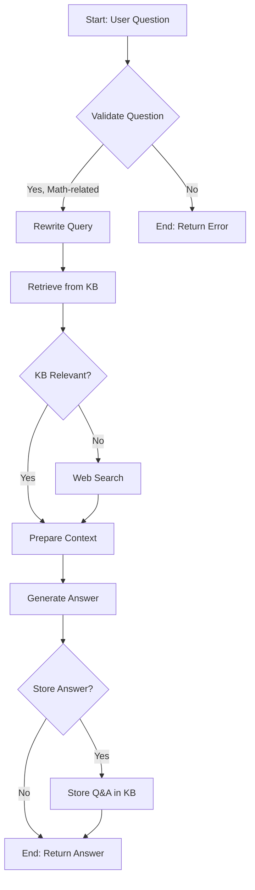

# Math Tutor

This project is a Math Tutor application that uses a Retrieval-Augmented Generation (RAG) pipeline to answer math-related questions. It consists of a Python backend and a React frontend.

## Overview

The Math Tutor is designed to assist users with their math-related queries by providing accurate and context-aware answers. It leverages a powerful RAG pipeline that retrieves relevant information from a knowledge base of PDF documents and uses it to generate comprehensive answers. The application features a user-friendly chat interface that supports LaTeX for rendering mathematical equations, making it an ideal tool for students, educators, and anyone in need of a reliable math assistant.

## Features

- **RAG Pipeline**: The core of the application is a sophisticated RAG pipeline that ensures high-quality answers by combining information retrieval with generative AI.
- **PDF Ingestion**: Users can easily expand the knowledge base by ingesting PDF documents through a simple API endpoint.
- **Math-Related Guardrails**: The application uses Guardrails to ensure that the questions are relevant to mathematics and that the generated answers are appropriate and safe.
- **Interactive Chat Interface**: The frontend provides a seamless chat experience, allowing users to ask questions and receive answers in real-time.
- **LaTeX Support**: The chat interface supports LaTeX, enabling the clear and accurate rendering of mathematical equations.
- **Feedback Mechanism**: Users can provide feedback on the answers, which can be used to further improve the performance of the RAG pipeline.

## RAG Pipeline Diagram

The following diagram illustrates the flow of the RAG pipeline, from receiving a user's question to generating and storing an answer.



## Architecture

The application is built with a modern architecture that separates the backend and frontend, allowing for independent development and deployment.

### Backend

- **Framework**: The backend is built with **FastAPI**, a high-performance web framework for building APIs with Python.
- **Asynchronous Task Processing**: **Inngest** is used for handling asynchronous tasks, such as the ingestion of PDF documents.
- **LLM Orchestration**: The RAG pipeline is orchestrated using **LangChain** and **LangGraph**, which provide a flexible and powerful way to build complex LLM-powered applications.
- **Vector Store**: **Qdrant** is used as the vector store for storing and retrieving the document embeddings.
- **Dependencies**: The backend relies on a set of powerful libraries, including `google-genai`, `qdrant-client`, `langchain`, `fastapi`, and `inngest`.

### Frontend

- **Framework**: The frontend is built with **React**, a popular JavaScript library for building user interfaces.
- **Build Tool**: **Vite** is used as the build tool, providing a fast and efficient development experience.
- **Dependencies**: The frontend uses `axios` for making API requests, `react-latex-next` for rendering LaTeX, and `katex` for the underlying math typesetting.

## Technology Choices

### Why Inngest?

**Inngest** was chosen for asynchronous task processing, particularly for PDF ingestion, for the following reasons:

- **Non-Blocking Operations**: PDF parsing and embedding can be time-consuming. Offloading these tasks to Inngest ensures that the main API remains responsive and doesn't get blocked by long-running processes. This leads to a better user experience, as the user can receive an immediate acknowledgment that their document is being processed.
- **Reliability and Durability**: Inngest provides built-in support for retries, error handling, and logging. If a PDF fails to process for any reason (e.g., a temporary network issue or a corrupted file), Inngest can automatically retry the task or move it to a dead-letter queue for manual inspection, ensuring that no data is lost.
- **Scalability**: By decoupling the task submission from the execution, we can scale the number of workers that process the ingestion tasks independently of the main application. This allows the system to handle a large volume of document uploads without affecting the performance of the core API.

### Why LangChain and LangGraph?

**LangChain** and **LangGraph** are used for orchestrating the RAG pipeline due to their power and flexibility in building complex, stateful LLM applications.

- **LangChain**: Provides the fundamental building blocks for the application.
    - **Abstractions**: It offers standardized interfaces for interacting with LLMs, vector stores, and other components, which makes the code cleaner and more maintainable.
    - **Prompt Management**: It provides powerful tools for creating, managing, and optimizing prompts, which is crucial for guiding the behavior of the LLM.
    - **Ecosystem**: It has a vast ecosystem of integrations with various tools and services, which makes it easy to extend the functionality of the application.

- **LangGraph**: An extension of LangChain that is specifically designed for building stateful, multi-step applications with cyclical and conditional flows.
    - **Stateful Execution**: LangGraph allows us to define a shared state (`GraphState`) that is passed between the different steps (nodes) of the pipeline. This is essential for a RAG pipeline, where data such as the rewritten query, retrieved documents, and conversation history needs to be managed across multiple steps.
    - **Conditional Logic**: RAG pipelines are not always linear. For example, we might need to perform a web search only if the knowledge base doesn't contain relevant information. LangGraph's support for conditional edges makes it easy to implement this kind of logic.
    - **Flexibility**: It allows for the creation of graphs with cycles, which can be used to implement more advanced techniques like self-correction, where the model can reflect on its own output and iteratively improve it.

## Project Structure

The project is organized into the following directories:

- `src/`: Contains the core backend source code, including the RAG pipeline, API endpoints, and configuration.
- `ui/math-tutor-ui/`: Contains the frontend React application.
- `data/`: Stores the PDF documents that are ingested into the knowledge base.
- `config/`: Contains the backend configuration files, such as `config.yaml` and `params.yaml`.
- `notebook/`: Contains Jupyter notebooks for testing and experimentation.

## Backend Components

The backend is composed of several components that work together to form the RAG pipeline. Each component is responsible for a specific task, from data ingestion to answer generation.

### `data_ingestion.py`

- **Purpose**: This component is responsible for loading PDF documents, splitting them into smaller chunks, and generating embeddings for the text chunks and user queries.
- **Core Logic**:
    - `load_and_chunk_pdf`: This method uses the `PDFReader` from `llama_index` to load the content of a PDF file. It then uses a `SentenceSplitter` to break down the text into smaller, more manageable chunks. This is crucial for effective retrieval, as it allows the system to find more specific and relevant pieces of information.
    - `embed_texts`: This method takes a list of text chunks and uses the `google-genai` client to generate embeddings for them. It specifies the `task_type` as `RETRIEVAL_DOCUMENT`, which optimizes the embeddings for retrieval.
    - `embed_query`: This method is similar to `embed_texts`, but it's designed for user queries. It specifies the `task_type` as `RETRIEVAL_QUERY` and includes an in-memory cache to avoid re-computing embeddings for the same query.
- **Inputs and Outputs**:
    - **Inputs**: PDF file paths, text chunks, user queries.
    - **Outputs**: Text chunks, document embeddings, query embeddings.
- **Key Dependencies and their Roles**:
    - `google-genai`: Used to access Google's generative models for creating text embeddings.
    - `llama_index`: Provides the `PDFReader` and `SentenceSplitter` for efficient document processing.
- **Usefulness/Contribution**: This component is the foundation of the knowledge base. It transforms unstructured data from PDFs into a structured format (embeddings) that can be indexed and searched by the vector store.

### `data_storing.py`

- **Purpose**: This component provides an interface for interacting with the Qdrant vector store. It handles the creation of the collection, upserting of vectors, and searching for similar vectors.
- **Core Logic**:
    - `__init__`: The constructor initializes the Qdrant client and ensures that the specified collection exists. If it doesn't, it creates a new collection with the correct vector parameters (size and distance metric).
    - `upsert`: This method takes a list of IDs, vectors, and payloads and upserts them into the Qdrant collection. This is used to add new documents to the knowledge base.
    - `search`: This method takes a query vector and searches for the most similar vectors in the collection. It supports a `score_threshold` to filter out irrelevant results.
    - `delete_by_source`: This method allows for the deletion of all vectors associated with a specific source, which is useful for managing the knowledge base.
- **Inputs and Outputs**:
    - **Inputs**: Document IDs, embeddings, payloads, query vectors.
    - **Outputs**: Search results (contexts, sources, scores), status of delete operations.
- **Key Dependencies and their Roles**:
    - `qdrant-client`: The official Python client for interacting with the Qdrant vector database.
- **Usefulness/Contribution**: This component provides a stable and reliable interface for managing the vector store. It decouples the rest of the application from the specific implementation of the vector database.

### `data_validate.py`

- **Purpose**: This component uses Guardrails to validate that the user's question is math-related.
- **Core Logic**:
    - `validate_question`: This method takes the user's question and passes it to the `input_guard.validate()` method. If the validation passes, it returns `{"is_valid": True}`. If it fails, it catches the `ValidationError` and returns `{"is_valid": False}` along with a predefined message.
- **Inputs and Outputs**:
    - **Inputs**: The user's question from the `GraphState`.
    - **Outputs**: A dictionary indicating whether the question is valid and, if not, a message to be returned to the user.
- **Key Dependencies and their Roles**:
    - `guardrails`: Used to define and enforce the input validation rules. The actual rules are defined in a separate `.co` file.
- **Usefulness/Contribution**: This component ensures that the RAG pipeline only processes relevant questions, which saves computational resources and prevents the model from generating nonsensical answers to off-topic queries.

### `query_rewrite.py`

- **Purpose**: This component rewrites the user's question based on the chat history to make it a standalone query.
- **Core Logic**:
    - `rewrite_query`: This method checks if there is any chat history. If not, it returns the original question. If there is history, it formats the history and the new question into a prompt and sends it to the language model. The model then returns a rewritten, standalone question.
- **Inputs and Outputs**:
    - **Inputs**: The user's question and the chat history from the `GraphState`.
    - **Outputs**: A dictionary containing the rewritten (or original) question.
- **Key Dependencies and their Roles**:
    - `langchain_openai`: Provides the `ChatOpenAI` client for interacting with the language model.
- **Usefulness/Contribution**: This component is crucial for maintaining context in a conversational setting. It ensures that the retrieval system receives a clear and unambiguous query, which leads to more accurate document retrieval.

### `data_retrieve.py`

- **Purpose**: This component retrieves relevant documents from the Qdrant vector store based on the user's question.
- **Core Logic**:
    - `retrieve`: This method first generates an embedding for the user's question using the `DataLoader`. It then uses the `QdrantStorage` to search for the most similar documents in the vector store. It uses a `RELEVANCE_THRESHOLD` to filter out documents that are not sufficiently similar to the query.
- **Inputs and Outputs**:
    - **Inputs**: The user's question from the `GraphState`.
    - **Outputs**: A dictionary containing the retrieved documents and a flag indicating whether the knowledge base was relevant.
- **Key Dependencies and their Roles**:
    - `qdrant-client`: Used indirectly through the `QdrantStorage` component to search the vector store.
- **Usefulness/Contribution**: This is the heart of the "retrieval" part of the RAG pipeline. The quality of the retrieved documents directly impacts the quality of the generated answer.

### `web_search.py`

- **Purpose**: This component performs a web search using Firecrawl MCP to retrieve up-to-date information from the internet.
- **Core Logic**:
    - `web_search`: This method loads the MCP configuration, finds the `firecrawl_search` tool, and invokes it with the user's question. It then formats the search results into a single string and returns them.
- **Inputs and Outputs**:
    - **Inputs**: The user's question from the `GraphState`.
    - **Outputs**: A dictionary containing the web search results as a list of documents.
- **Key Dependencies and their Roles**:
    - `langchain_mcp_adapters`: Provides the `MultiServerMCPClient` for interacting with the MCP server.
- **Usefulness/Contribution**: This component extends the knowledge base of the RAG pipeline beyond the ingested PDF documents. It allows the Math Tutor to answer questions about current events or topics that are not covered in the local knowledge base.

### `prepare_context.py`

- **Purpose**: This component prepares the context for the language model by combining the retrieved documents and the conversation history.
- **Core Logic**:
    - `prepare_context`: This method checks the token count of the conversation history. If it's below a certain threshold, it uses the full history. If it's above the threshold, it uses a language model to summarize the history. It then combines the (summarized) history with the retrieved documents to form the final context.
- **Inputs and Outputs**:
    - **Inputs**: The chat history and retrieved documents from the `GraphState`.
    - **Outputs**: A dictionary containing the summary of the conversation history.
- **Key Dependencies and their Roles**:
    - `langchain_openai`: Used to summarize the conversation history when it exceeds the token limit.
- **Usefulness/Contribution**: This component is responsible for constructing the prompt that is sent to the language model. It plays a critical role in balancing the amount of context provided to the model, which affects both the quality of the answer and the cost of the API call.

### `answer_generate.py`

- **Purpose**: This component generates an answer to the user's question using a large language model (LLM).
- **Core Logic**:
    - `generate`: This method constructs a prompt using the user's question, the retrieved documents, and the conversation summary. It then sends the prompt to the language model to generate an answer. After generating the answer, it uses an `output_guard` to validate the generated text.
- **Inputs and Outputs**:
    - **Inputs**: The user's question, retrieved documents, and conversation summary from the `GraphState`.
    - **Outputs**: A dictionary containing the generated answer and the updated token count.
- **Key Dependencies and their Roles**:
    - `langchain_openai`: Provides the `ChatOpenAI` client for generating the answer.
    - `guardrails`: Used to validate the output of the language model.
- **Usefulness/Contribution**: This is the final step in the RAG pipeline. It takes all the retrieved and prepared information and uses it to generate a high-quality, context-aware answer to the user's question.

### `data_store_and_update.py`

- **Purpose**: This component stores the newly generated question-answer pair back into the vector store.
- **Core Logic**:
    - `store_answer`: This method takes the user's question and the generated answer, formats them into a Q&A document, generates an embedding for the document, and upserts it into the Qdrant vector store. It generates a stable, unique ID for the document based on the question.
- **Inputs and Outputs**:
    - **Inputs**: The user's question and the generated answer from the `GraphState`.
    - **Outputs**: None (this is a terminal node in the graph).
- **Key Dependencies and their Roles**:
    - `qdrant-client`: Used indirectly through the `QdrantStorage` component to upsert the new document.
- **Usefulness/Contribution**: This component creates a feedback loop that allows the system to learn from its interactions. Over time, a knowledge base will grow with new Q&A pairs, which will improve the accuracy and efficiency of the retrieval process.

## Component Interaction and State Management

The RAG pipeline's components communicate and share information through a central `GraphState` object, which is a core concept in LangGraph. This `GraphState` acts as a mutable, dictionary-like container that holds all the relevant data for the current execution of the pipeline. It is defined as a `dataclass` in `src/Math/entity/config_entity.py` and includes fields such as `question`, `documents`, `generation`, `history`, `is_kb_relevant`, `is_valid`, `summary`, `history_tokens`, and `is_web_search_result`.

### How Components Update the State

Each component function (or method) within the LangGraph pipeline is designed to:

1.  **Receive the current `GraphState`**: The function takes the `GraphState` object as an input parameter, allowing it to access all the information accumulated by previous steps.
2.  **Perform its specific logic**: Based on the data in the `GraphState`, the component executes its designated task (e.g., validating a question, rewriting a query, retrieving documents).
3.  **Return a dictionary of updates**: Instead of returning an entirely new `GraphState`, each component returns a dictionary containing only the fields it intends to modify or add to the state.
4.  **LangGraph merges updates**: LangGraph automatically takes this returned dictionary and merges its contents into the existing `GraphState`. This ensures that the state is always up-to-date with the latest information as it flows through the pipeline.

This mechanism allows for a clear separation of concerns, where each component focuses on its specific task while contributing to the overall state of the RAG process.

### Examples of State Updates by Components:

Let's look at how some key components interact with and update the `GraphState`:

-   **`data_validate.py` (`ValidateQuestion`)**:
    -   **Reads**: `state.question` (to check if it's math-related).
    -   **Writes**: If the question is invalid, it updates `{"is_valid": False, "generation": "error message"}`. This `is_valid` flag is then used by LangGraph's conditional edges to determine if the pipeline should continue or terminate early.

-   **`query_rewrite.py` (`QueryRewriter`)**:
    -   **Reads**: `state.question` (the original user query) and `state.history` (the conversation history).
    -   **Writes**: `{"question": "rewritten standalone question"}`. This updated `question` field is then used by subsequent components like `data_retrieve` to perform more effective searches.

-   **`data_retrieve.py` (`DataRetrieve`)**:
    -   **Reads**: `state.question` (the potentially rewritten query).
    -   **Writes**: `{"documents": [...], "is_kb_relevant": True/False}`. The `documents` field is populated with retrieved text chunks, and `is_kb_relevant` is a crucial flag that dictates whether the pipeline proceeds to `prepare_context` directly or first attempts a `web_search`.

-   **`web_search.py` (`WebSearch`)**:
    -   **Reads**: `state.question`.
    -   **Writes**: `{"documents": [...], "is_web_search_result": True}`. If a web search is performed, this component updates the `documents` field with web search results and sets a flag indicating the source of the information.

-   **`answer_generate.py` (`Generate`)**:
    -   **Reads**: `state.question`, `state.documents` (from KB or web search), `state.summary` (from conversation history), and `state.history_tokens`.
    -   **Writes**: `{"generation": "LLM generated answer", "history_tokens": new_total_tokens}`. This component produces the final answer and updates the total token count for the conversation.

-   **`data_store_and_update.py` (`StoreAndUpdate`)**:
    -   **Reads**: `state.question` and `state.generation`.
    -   **Writes**: None to the `GraphState` itself, as it's typically a terminal node that performs a side effect (upserting data into Qdrant).
    -   **Impact**: This component uses the information from the state to persist new knowledge, creating a feedback loop for continuous improvement of the knowledge base.

This state management approach ensures that each component has access to the necessary information while maintaining a modular and extensible pipeline design.

## Getting Started

To get started with the Math Tutor application, you will need to set up both the backend and the frontend.

### Prerequisites

- Python 3.8 or higher
- Node.js 14 or higher
- An API key for the Google Generative AI service

### Backend Setup

1. **Install dependencies**:
   ```bash
   pip install -r requirements.txt
   ```

2. **Configure the application**:
   - Create a `.env` file in the root directory and add your Google API key:
     ```
     GOOGLE_API_KEY=your_api_key
     ```
   - Update the `config/config.yaml` and `params.yaml` files as needed.

3. **Run the FastAPI server**:
   ```bash
   uvicorn main:app --host 0.0.0.0 --port 8000
   ```

### Frontend Setup

1. **Navigate to the UI directory**:
   ```bash
   cd ui/math-tutor-ui
   ```

2. **Install dependencies**:
   ```bash
   npm install
   ```

3. **Run the development server**:
   ```bash
   npm run dev
   ```

## Usage

Once both the backend and frontend servers are running, you can access the Math Tutor application by opening your web browser and navigating to `http://localhost:5173` (or the port specified by the Vite development server).

You can ask math-related questions in the chat interface and receive answers from the RAG pipeline. To add new documents to the knowledge base, you can use the `/ingest` endpoint of the backend API.

## Development Conventions

- **Backend Configuration**: The backend configuration is managed through `config/config.yaml` and `params.yaml`.
- **Logging**: The backend uses a structured logging format, and the logs are stored in the `logs/` directory.
- **Frontend Code**: The frontend code is located in the `ui/math-tutor-ui/src` directory, and the main React component is `App.jsx`.
- **Code Style**: Please follow the existing code style and conventions when contributing to the project.
- **Commit Messages**: Write clear and descriptive commit messages that explain the purpose of your changes.